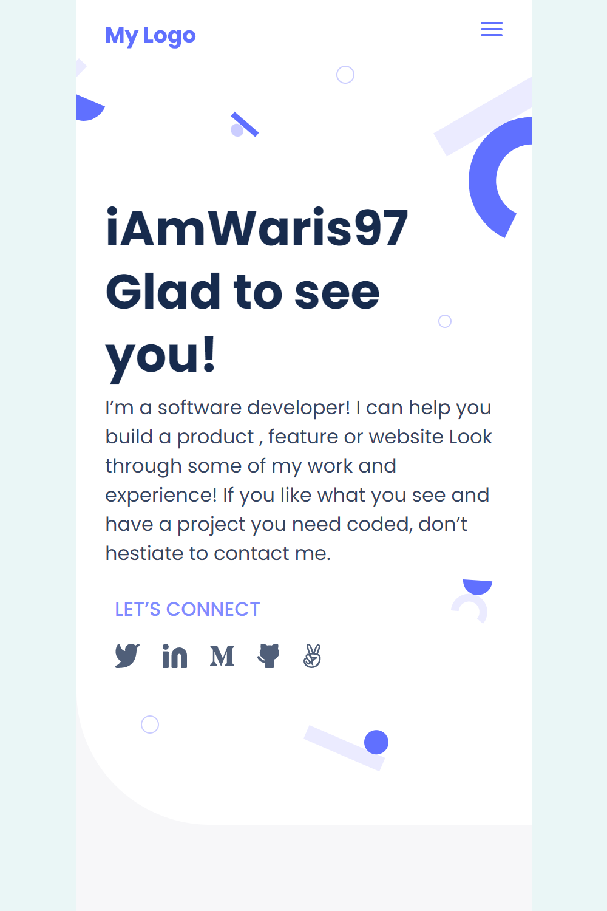

# iAmWaris97 | Portfolio

> My persnal portfolio project

This is the second project as part of the Microverse first week projects!
In this project I have made first two sections of my portfolio mobile version using HTML/CSS.

## Built With

- HTML
- CSS

## Author:

👤 **Waris Haleem**

- GitHub: [@iAmWaris97](https://github.com/iAmWaris97)
- Twitter: [@iAmWaris97](https://twitter.com/iAmWaris97)
- LinkedIn: [Waris Haleem](https://www.linkedin.com/in/waris-haleem/)

## 🤝 Contributing

Contributions, issues, and feature requests are welcome!

Feel free to check the [issues page](https://github.com/iAmWaris97/iAmWaris97-Portfolio/issues).

## Show your support

Give a ⭐️ if you like this project!

## Acknowledgments

- Hat tip to anyone whose code was used
- Inspiration
- etc

## 📝 License

This project is [MIT](./MIT.md) licensed.