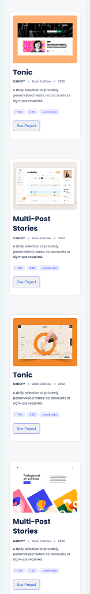

# iAmWaris97 | Portfolio

> My persnal portfolio project

This is the third project as part of the Microverse first week projects!
In this project I have made projects and about me sections of my portfolio mobile version using HTML/CSS.

## Built With

- HTML
- CSS

## Live Demo

[Live Demo Link](https://iamwaris97.github.io/iAmWaris97-Portfolio/)

## Getting Started

>To get a local copy of this project follow the following steps:

-Clone this repository with

<code>git clone https://github.com/iAmWaris97/iAmWaris97-Portfolio</code> using your terminal or command line.

-Change to the project directory by entering :

<code>cd iAmWaris97-Portfolio</code> in the terminal.

-run <code>code . </code>to open it in VSCode

## Author:

👤 **Waris Haleem**

- GitHub: [@iAmWaris97](https://github.com/iAmWaris97)
- Twitter: [@iAmWaris97](https://twitter.com/iAmWaris97)
- LinkedIn: [Waris Haleem](https://www.linkedin.com/in/waris-haleem/)

## 🤝 Contributing

Contributions, issues, and feature requests are welcome!

Feel free to check the [issues page](https://github.com/iAmWaris97/iAmWaris97-Portfolio/issues).

## Show your support

Give a ⭐️ if you like this project!

## Acknowledgments

- Hat tip to anyone whose code was used
- Inspiration
- etc

## 📝 License

This project is [MIT](./MIT.md) licensed.